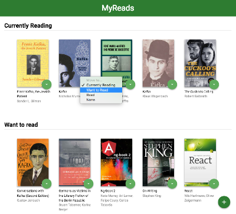
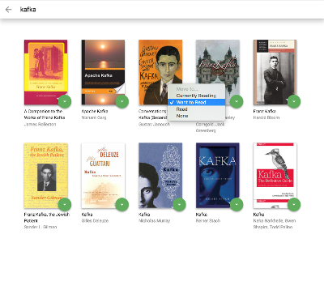

# MyReads Project

This app allows you to search, select and categorize books you are currently reading, want to read or have read. Main focus was on learning React and putting that knowledge in action to build this app.




# Quickstart

Clone from GIT repository.
```
git clone https://github.com/PeMajer/Project-9_MyReads_App.git
```
Open directory.
```
cd Project-9_MyReads_App
```
Install packages.
```
npm install
```
Run.
```
npm start
```

## Backend Server

To simplify your development process, we've provided a backend server for you to develop against. The provided file [`BooksAPI.js`](src/BooksAPI.js) contains the methods you will need to perform necessary operations on the backend:

* [`getAll`](#getall)
* [`update`](#update)
* [`search`](#search)

### `getAll`

Method Signature:

```js
getAll()
```

* Returns a Promise which resolves to a JSON object containing a collection of book objects.
* This collection represents the books currently in the bookshelves in your app.

### `update`

Method Signature:

```js
update(book, shelf)
```

* book: `<Object>` containing at minimum an `id` attribute
* shelf: `<String>` contains one of ["wantToRead", "currentlyReading", "read"]
* Returns a Promise which resolves to a JSON object containing the response data of the POST request

### `search`

Method Signature:

```js
search(query)
```

* query: `<String>`
* Returns a Promise which resolves to a JSON object containing a collection of a maximum of 20 book objects.
* These books do not know which shelf they are on. They are raw results only. You'll need to make sure that books have the correct state while on the search page.

## Important
The backend API uses a fixed set of cached search results and is limited to a particular set of search terms, which can be found in [SEARCH_TERMS.md](SEARCH_TERMS.md). That list of terms are the _only_ terms that will work with the backend, so don't be surprised if your searches for Basket Weaving or Bubble Wrap don't come back with any results.

## Contributing
* Fork the repository.
* Create a branch for the work you’re going to do.
* Make your changes in your branch.
* Send a pull request from your branch to this repository.

## License
It is free software, and may be redistributed under the terms specified in the [license file](LICENSE.md).
